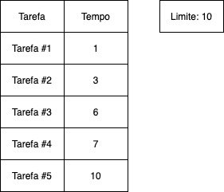
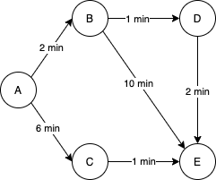
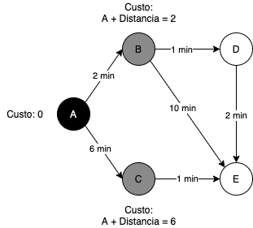
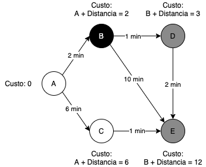
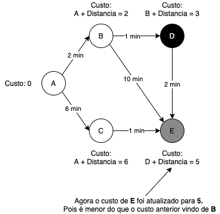
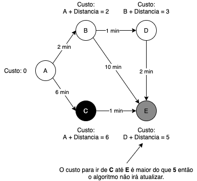

Um algoritmo guloso pode ser utilizado para resolver problemas que não possuem um algoritmo que resolveria de forma rápida.

Esse algoritmo, em cada iteração, irá fazer a escolha que parece ser a melhor no momento para chegar na melhor solução final que ele consegue.

## Implementação

Um exemplo básico, você possui um tempo limite para completar uma série de tarefas e cada tarefa possui um tempo para ser completada.



Esse é um problema que um algoritmo guloso pode resolver. Você precisa escolher o máximo de tarefas que consegue completar dentro desse limite.

```py
tasks = [1, 3, 6, 7, 10]
max_time = 10
current_time = 0
current_tasks = 0

for task_time in tasks:
    current_time += task_time
    
    if current_time > max_time:
        break
    
    current_tasks += 1
```

Veja que a lista de tarefas está ordenada e a cada iteração o algoritmo irá adicionar o tempo da tarefa `task_time` ao tempo atual `current_time` e fazer uma verificação, caso o tempo não tenha atingido o limite, o algoritmo irá incrementar o número de tarefas para fazer `current_tasks`, caso contrário o loop é encerrado.

Esse algoritmo em nenhum momento volta atrás de uma decisão, ele apenas escolhe a tarefa pensando que ela é a ideal para o momento.

E a resposta final desse algoritmo é **3** tarefas.

## Algoritmo de Dijkstra

O algoritmo de [Dijkstra](https://pt.wikipedia.org/wiki/Edsger_Dijkstra) também é um ótimo exemplo de um algoritmo guloso, ele é usado para calcular o caminho mínimo entre um vértice inicial e todos os outros vértices em um [grafo com pesos](https://pt.wikipedia.org/wiki/Grafo_valorado) não negativos.



Esse algoritmo é considerado guloso pois a cada iteração ele irá tentar fazer o movimento que tem o menor peso de acordo com as possibilidades atuais e o algoritmo nunca voltará atrás de uma decisão que ele tenha feito.

## Implementação

Vou utilizar apenas algumas partes do código para explicar, mas o código completo você pode ver aqui: [dijkstra.py](https://gist.github.com/gucastiliao/5a819d521a66fa665ba3ce63aa647b6d)

Para inicializar, precisamos definir os vértices e os pesos das arestas do nosso grafo. 

Essa é a representação do diagrama mostrado acima:
```py
graph = Graph()

# Vértices
graph.add_node('a')
graph.add_node('b')
graph.add_node('c')
graph.add_node('d')
graph.add_node('e')

# Arestas com os pesos
graph.add_edge('a', 'b', 2)
graph.add_edge('a', 'c', 6)

graph.add_edge('b', 'd', 1)
graph.add_edge('b', 'e', 10)

graph.add_edge('c', 'e', 1)

graph.add_edge('d', 'e', 2)
```

O primeiro passo do algoritmo é definir o ponto inicial e nesse caso vai ser o **A** e como este ponto é o início, ele vai ter custo **0** pois para chegar até ele não existe nenhum outro passo. Já os outros vértices receberão o custo como **infinito** pois como não sabemos ainda como chegar neles precisamos definir o maior custo possível.

O algoritmo então irá procurar o vértice que tenha o menor custo e que ainda não foi visitado. Todos os outros vértices possuem o custo definido como **infinito**, então o que terá o menor custo será o vértice **A** e esse é o ponto inicial do algoritmo.



Para cada movimento a partir de **A**, o algoritmo irá atualizar os custos para se chegar até eles, somando o custo de **A** que é **0** com o peso da distância, se essa soma for menor que o custo atual do vértice, então esse valor será atualizado. Lembrando que definimos todos os vértices com o custo **infinito**.

```py
# Busca o menor vértice ainda não visitado
node = graph.find_lowest_cost_node()

while node:
    # Recupera o custo desse vértice
    cost = graph.costs.get(node)
    
    # Recupera todas as arestas do vértice
    edges = graph.edges.get(node) if graph.edges.get(node) else []
    
    for edge in edges:
        distance = graph.distances.get((node, edge))
        new_cost = cost + distance
        
        current_edge_cost = graph.costs.get(edge)

        # Para cada aresta, realiza a soma do custo com a distância
        # E caso essa soma for menor que o custo atual, atualize o custo
        if new_cost < current_edge_cost:
            graph.update_node_cost(edge, new_cost)
            graph.update_node_parent(edge, node)

    # Marca o vértice como visitado
    graph.visit_node(node)

    # Busca o menor vértice ainda não visitado e continua o loop
    node = graph.find_lowest_cost_node()
```

O algoritmo marca o **A** como visitado e começa a iteração novamente, procurando o próximo vértice não visitado com o menor peso.

Nesse caso será o **B** e ele irá fazer os mesmos cálculos mostrados acima.



---

Agora para **D**:



---

O vértice **E** é o próximo, mas não possui nenhuma aresta, então o algoritmo irá apenas marcar como visitado.

---

Por último o algoritmo passa por **C**.

Note que **C** tem caminho para ir até **E**, porém ele não atualiza o custo pois é maior do que o custo atual em **E**:



---

O resultado final é:
```py
a -> b -> d -> e
```

E esse é o melhor caminho para **E** iniciando em **A**. Com o custo total de **5**.

O código completo você pode ver aqui: [dijkstra.py](https://gist.github.com/gucastiliao/5a819d521a66fa665ba3ce63aa647b6d)

## Algoritmo de Bellman-Ford

Para grafos ponderados e com pesos negativos o algoritmo de Dijkstra não irá funcionar, porém existe o [Algoritmo de Bellman-Ford](https://cp-algorithms-brasil.com/grafos/bellmanford.html) que pode ser utilizado para isso.

## Links Úteis

- [Algoritmos Gulosos](https://www.ime.usp.br/~pf/analise_de_algoritmos/aulas/guloso.html)
- [Exemplos visuais com animações](https://brilliant.org/wiki/greedy-algorithm/)
- [Algoritmo de Dijkstra](https://www.ime.usp.br/~pf/algoritmos_para_grafos/aulas/dijkstra.html)
- [Edsger Dijkstra](https://pt.wikipedia.org/wiki/Edsger_Dijkstra)
- [Estrutura de Dados - Grafos](https://www.youtube.com/watch?v=ovkITlgyJ2s)
